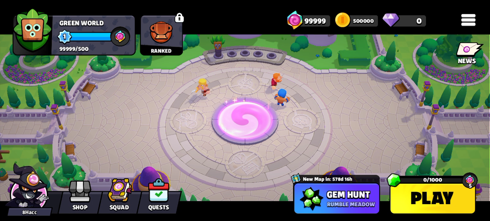

# OpenSquad

- An experimental [Squad Busters](https://squadbusters.supercell.com/) server (v1.1516.1) written in Python.

## What's working?
- Home
- Account Creation
- Setting Player Name
- You can play battles, but progression will not be saved

## Setup Process
To use this server, you need a pre-patched client which you can get [here](https://mega.nz/file/vscRxA6R#b4-RQ90YB9SqjCDKr_JkgawVDZ8TF6E2F0DCp3aVaFo). The client is set to connect locally by default, but the script's (`libhaccycat.so`) not compiled - so you're free to host servers.

Install the Cryptography library by going into Classes/Cryptography (in terminal) and typing `python setup.py install`. After that's done, you can run the server by running the `Main.py` file.

## DISCLAIMER
This Content and any of its Sub-contents are not affiliated with, endorsed, approved or specifically sponsored by Supercell, and Supercell is not responsible for it. For more information, see Supercell's Fan-Content Policy. This is a private server running separately from the official game servers. It’s just for learning and fun — not meant to mess with the original game or cause any issues for the developers.

## Contributions
This server will not be actively maintained and is not very functional at the moment, but feel free to contribute — all pull requests are welcome!

## Special Thanks ⭐
- [S.B](https://www.github.com/PeterHackz) - Original Frida Script
- [Gabriel5](https://github.com/Gabriel55ita) - Reflection, some packet dumps and help with cryptography
